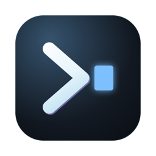
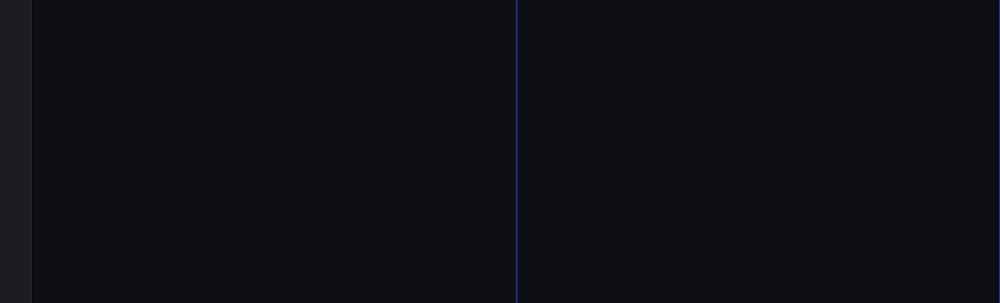

<div align="center">
  
  <h1>Vitra</h1>
  <p><strong>Um terminal nativo do macOS feito para hospedar agentes de código de linha de comando.</strong></p>
  <p>
    
    
    
    <a href="https://github.com/raniere57/vitra/releases/latest"></a>
    
  </p>
</div>



## O que é

Você já roda Claude Code, Codex ou outro agente num terminal. O Vitra é a janela
em volta disso: suas sessões do Claude Code listadas numa barra lateral e
retomadas com um clique, arquivos anexados ao prompt arrastando-os para o
painel, o que o agente escreve renderizado num painel de visualização ao lado, e
o espaço de trabalho inteiro — janelas, abas, divisões, pastas — de volta onde
você deixou depois de reiniciar.

Por baixo é um terminal de verdade, não um invólucro:
[libghostty-vt](docs/DEPENDENCIES.md) toca o núcleo VT e um renderizador Metal
com atlas de glifos do Core Text desenha. `vim`, `ssh` e `top` se comportam como
em qualquer outro terminal.

- **Sessões** — cada conversa do Claude Code na máquina, agrupada por projeto,
  pesquisável, retomada numa aba nova. A que você está é marcada.
- **Pastas** — diretórios favoritos num trilho na borda esquerda, cada um com
  ícone, cor e tema próprios; um clique abre uma aba já lá. Um favorito também
  pode ser um **servidor SSH**: o clique abre a aba já conectada, no diretório
  que você anotou.
- **Anexos** — solte um arquivo ou cole uma imagem e o caminho é digitado no
  prompt. Bytes nunca chegam perto do pty.
- **Painel de visualização** — HTML, Markdown, imagens, PDFs e um navegador de
  verdade, num WKWebView criado quando você abre e destruído quando você fecha.
- **Blocos de comando** — cada comando é um bloco com seu trilho, seu tempo e
  seu status de saída.
- **Servidor MCP** — compilado dentro do binário, então um agente rodando dentro
  do Vitra pode abrir um arquivo na visualização ou ler a página que está vendo.
  Não pode executar comando de shell nem ler arquivo que você não abriu.
- **Leve** — um processo. Cerca de 80 MB de memória por janela, e nenhum timer
  rodando quando a tela não muda. Todo número em
  [docs/MEASUREMENTS.md](docs/MEASUREMENTS.md) é medido, não estimado.

Requer macOS 14 ou posterior em Apple silicon.

## Instalação

Baixe a imagem de disco da
[última versão](https://github.com/raniere57/vitra/releases/latest), arraste o
Vitra para Aplicativos e limpe o sinalizador de quarentena:

```bash
xattr -dr com.apple.quarantine /Applications/Vitra.app
```

Esse último passo é necessário porque a imagem é assinada ad-hoc e não
notarizada — não há Developer ID por trás desta build. Vale entender em vez de
colar: o sinalizador é o que o macOS põe em tudo que é baixado, e limpá-lo é
você dizendo que confia nesta cópia.

## Compilação

```bash
scripts/vendor-ghostty-vt.sh     # uma vez: baixa e compila o núcleo VT fixado
swift build
swift test
scripts/build-app.sh --install   # gera dist/Vitra.app e copia para /Applications
```

## Publicação

```bash
scripts/make-icon.sh             # desenha o ícone e empacota dist/AppIcon.icns
scripts/release.sh               # build otimizada em tamanho, assinatura ad-hoc, dist/Vitra-<versão>.dmg
```

Arrumar os ícones dentro da imagem é feito controlando o Finder, então a
primeira execução pede permissão de Automação; sem ela a imagem funciona igual,
só abre em modo lista. Toda versão é registrada em [CHANGELOG.md](CHANGELOG.md).

## A CLI

O `vitra` vem dentro do bundle do app. Ligue-o ao seu PATH:

```bash
ln -s /Applications/Vitra.app/Contents/Helpers/vitra /usr/local/bin/vitra
```

```bash
vitra open relatorio.html    # mostra um arquivo no painel de visualização
```

## Pastas

Os diretórios favoritos vivem em `~/.vitra/bookmarks.json`, escrito pelo app.
Cada um carrega um emoji, uma cor opcional, um tema opcional e quantas etiquetas
você quiser, e abrir um começa uma aba cujo shell já está lá.

Um favorito pode morar em outra máquina. Preencha o **SSH host** na janela de
pastas — `usuário@máquina`, ou um apelido do seu `~/.ssh/config` — e o campo do
diretório passa a ser o diretório de lá. Clicar nele abre uma aba que roda
`ssh -t <host> 'cd "<diretório>" && exec "$SHELL" -l'`: um shell de login
naquela pasta, no servidor, e a barra de título mostra `host:/diretório`. Todo favorito — local ou remoto — tem um campo **Command**: o que estiver ali é
rodado quando a aba abre. Escreva `claude` e o favorito remoto vira
`ssh -t <host> 'cd "<diretório>" && exec "$SHELL" -lic "claude; exec \"$SHELL\" -l"'`.
O shell de lá é de login *e* interativo — é a única forma de o `PATH` que o nvm
ou o `~/.local/bin` monta chegar ao comando — e o shell de login esperando por
baixo faz sair do Claude deixar você no servidor em vez de desconectar. Nada é
lido do disco daqui — o caminho de um favorito remoto nunca é tratado como
caminho local — e a autenticação continua sendo a do seu ssh: o Vitra não guarda
senha nem chave, só a linha que ele digita.

Nada aqui fica escondido atrás de um atalho. Os favoritos vivem num **trilho** na
borda esquerda — um clique por pasta, a pasta da própria janela acesa na cor
dela — e o `+` embaixo abre o resto (ir para, abrir, favoritar, gerenciar). Os
favoritos são desenhados como SF Symbols em vez de emoji — um peso, um tamanho,
uma coluna — e o seletor na janela de pastas é esse mesmo conjunto; um favorito
criado antes dos ícones existirem mantém o glifo que o emoji representava. A
barra de título carrega uma **trilha**: a pasta, e depois para onde o shell em
foco andou desde então — a pasta é sempre nomeada, inclusive quando o shell está
na raiz dela. Ao lado dela vem a sessão do Claude Code em que o painel em foco
está, com o mesmo `✳` que a barra lateral usa: com a lateral recolhida, essa é a
única coisa na tela dizendo em qual conversa aquele terminal trabalha. Dois botões discretos ficam antes dela — pastas e
sessões — cada um aceso só enquanto a barra lateral correspondente está aberta;
dividir e o painel de visualização ficam num grupo à direita.

O trilho é a barra lateral recolhida. `Opt-Cmd-S`, o botão da barra de título, ou
simplesmente arrastar o divisor a alarga numa **árvore de pastas**: os favoritos
e a home como raízes, subdiretórios lidos só quando uma pasta é aberta. Clicar
numa pasta é um `cd` digitado no terminal em que você já está — não uma aba
nova, não uma janela nova — e `Cmd-clique` é a exceção que abre uma. A pasta em
que o shell em foco está fica selecionada na árvore, e a árvore se abre até ela,
então a barra lateral sempre diz onde você está, inclusive depois de um `cd` que
você mesmo digitou.

Acima da árvore há um **filtro**: digite parte do nome de uma pasta e a árvore
vira uma lista plana de resultados, cada um com a pasta onde vive. Ele busca um
nível abaixo de cada raiz mais tudo que já foi aberto, que é o que o mantém
instantâneo — nada varre o disco em segundo plano. `Return` leva ao primeiro
resultado, `Esc` limpa o campo e devolve o teclado ao terminal.

Com mais de um painel, o painel que está com o teclado ganha um anel na cor da
pasta. Painéis e o painel de visualização são redimensionados arrastando os
divisores: a linha tem um pixel, a faixa de pega tem cinco pixels de cada lado.

- `Cmd-P` é o seletor rápido: digite parte de um nome, de um caminho ou de uma
  etiqueta e aperte Return. Os termos são combinados com E, então `api work`
  estreita em vez de alargar.
- `Cmd-Ctrl-D` favorita o diretório em que o shell em foco está agora, lido do
  processo e não de onde a aba começou.
- **Folders ▸ Manage Folders…** é onde nomes, emoji, cores, temas e etiquetas
  são editados.

O tema de uma pasta vence o da configuração, que é justamente o motivo de
defini-lo: uma aba em produção não deveria parecer uma aba num diretório de
rascunho. A cor dela vira uma faixa de dois pixels sob a barra de título daquela
janela, e o emoji prefixa o título, que é o que a barra de abas mostra.

Uma janela abre preenchida — a tela menos a barra de menus e o Dock, o "Preencher"
do botão verde e não tela cheia —, então a barra de menus e todas as outras
janelas ficam onde estão.

## Como as barras laterais são desenhadas

As duas metades são uma superfície só, então são desenhadas com as mesmas
medidas: a mesma margem para o campo de busca, para as linhas e para o rodapé, a
mesma placa arredondada sob uma linha, o mesmo fio entre grupos. A linha acende
sob o ponteiro, e a placa é recuada das duas bordas em vez de sangrar pela
coluna inteira, que é o que a seleção padrão faz.

O estilo de tabela do próprio sistema está desligado nas duas: o estilo `inset`
insere uma faixa própria em cada linha de grupo, e era essa faixa a origem dos
vãos irregulares entre projetos.

## Sessões

`Opt-Cmd-C`, ou o segundo botão da barra de título, abre a mesma barra lateral
nas **sessões do Claude Code desta máquina** — o mesmo repositório que a CLI e o
app desktop compartilham, `~/.claude/projects/`. Clicar numa delas abre um painel novo ao lado e digita nele
`cd <projeto> && claude --resume <id>`, então a conversa reabre onde estava sem
tomar o painel em que você já estava — a de antes continua rodando, e você fecha
quando quiser. O campo de
filtro busca títulos e nomes de projeto.

### opencode

`Opt-Cmd-O`, ou o terceiro botão da barra de título, abre a mesma barra lateral
nas **sessões do opencode** — a lista tem as mesmas linhas, o mesmo filtro e a
mesma marca de "é esta que está rodando aqui", lida do banco SQLite do opencode
(`~/.local/share/opencode/opencode.db`, aberto só para leitura) e reaberta com
`cd <projeto> && opencode --session <id>`. Sub-sessões de subagentes ficam fora
da lista, e uma conversa que o opencode ainda não nomeou é chamada pela pasta.

Um painel rodando opencode é reconhecido pelo processo que segura o terminal, e
não pelo título — o opencode não renomeia o terminal —, então a barra de título
diz `◆ <sessão>` como diz `✳ <sessão>` para o Claude Code.

Para o opencode usar o navegador embutido e o painel de visualização, registre o
servidor MCP dele no `~/.config/opencode/opencode.json`:

```json
{
  "mcp": {
    "vitra": {
      "type": "local",
      "command": ["/Applications/Vitra.app/Contents/Helpers/vitra", "mcp"],
      "enabled": true
    }
  }
}
```

`opencode mcp list` deve dizer `vitra ✓ connected`.

As sessões são agrupadas por projeto, projeto mais recente primeiro, com um
ponto colorido e a contagem ao lado do nome; projetos começam dobrados e um
clique abre um, o que impede que um repositório movimentado enterre os outros
dezesseis — todo projeto cabe na tela de uma vez. Um fio separa uma sessão da
seguinte, e cada linha carrega o título sobre o dia e a hora do último trabalho
— hoje e ontem nomeados pelo sistema, mais antigo datado — porque quatro sessões
do mesmo projeto se distinguem por *quando*, e não por "4 dias atrás". Uma
sessão rodada numa worktree ganha a worktree como chip ao lado da data.

A sessão em que o painel em foco está carrega um trilho de destaque na borda de
início, um título mais pesado, e o projeto dela se abre para mostrá-la — uma
marca atrás de uma dobra não responde nada a ninguém. A sessão é conhecida de
saída quando a barra lateral a iniciou, e reconhecida nos outros casos: o Claude
Code nomeia o terminal com o nome da conversa, então um painel rodando um
programa numa pasta que tem sessões é casado com aquela cujo título ele está
vestindo. Títulos derivam — o resumo da transcrição é reescrito conforme a
conversa avança, e um longo chega ao terminal cortado — então um título que é
prefixo do outro conta, e um painel claramente rodando Claude Code num projeto
recai na sessão mais recente daquele projeto. Entre um caminho e outro, as
sessões iniciadas à mão, retomadas de dentro do Claude Code ou começadas por uma
compactação ficam todas marcadas. Isso se lê: com uma dúzia de conversas
dividindo três ou quatro nomes, "em qual eu estou" é, sem isso, uma pergunta que
a barra lateral não sabe responder. É uma marca e não uma seleção — seleção é a
linha que você clicou por último, que é outra pergunta — e ela segue o teclado de
painel em painel, limpando-se quando a sessão termina.

Uma compactação ou uma retomada começa uma transcrição *nova*, então uma conversa
pode deixar uma dúzia de arquivos para trás — que é o motivo de a lista mostrar
vinte e cinco sessões de um projeto que o app lista com dez. O índice do app
nomeia os ids que substituiu (`priorCliSessionIds`) e esses são descartados; uma
transcrição que o índice nunca viu também é descartada quando abre com o resumo
"This session is being continued…" da própria CLI, e dois arquivos com o mesmo
prompt inicial no mesmo projeto colapsam no mais recente — o que vale reabrir. O
que sobrevive é uma conversa, não um pedaço de uma.

Sessões arquivadas no app desktop ficam fora da lista. O app guarda um JSON
pequeno por sessão em `~/Library/Application Support/Claude/`, e esse é o único
lugar onde `isArchived` — e o título que o usuário deu à sessão — existe; a
transcrição não sabe de nenhum dos dois. Quando o app nunca foi usado aqui, o
índice simplesmente não existe e toda transcrição é mostrada. O rodapé diz
quantas estão escondidas e as traz de volta com um clique.

Os títulos vêm desse índice primeiro, depois do `custom-title` da própria
transcrição, recaindo no prompt com que a sessão começou, ou no comando de barra
quando foi só isso. Só as transcrições mais recentes são lidas, e só 32 KB do
começo e 64 KB do fim de cada uma: um arquivo de sessão chega a dezenas de
megabytes e a barra lateral precisa de uma linha dele. A leitura acontece fora da
thread principal, na primeira vez que a lista é mostrada — nunca no lançamento.

Clicar numa sessão digita `cd <projeto> && claude --resume <id>` no painel que
está com o teclado — a menos que já haja algo rodando nele. Um painel com um
programa em primeiro plano lê o que recebe como *entrada*, que é como o comando
acabava dentro da caixa de conversa do próprio Claude Code; o tty diz quem
segura o terminal (`tcgetpgrp`), e um painel ocupado recebe a sessão numa aba
nova.

Uma pasta nessa lista navega a própria lista, e leva o terminal junto com um `cd`
quando o shell está livre para aceitar. Quando algo está rodando no painel —
Claude Code, vim, less — nada é digitado nele: o tty diz quem segura o terminal,
e a lista se move sozinha. A mesma regra decide o que uma pasta na barra lateral
esquerda faz: `cd` num painel livre, aba nova num ocupado.

## Um painel sozinho

Com o ponteiro sobre um painel, quatro botões aparecem no canto: o × fecha, o de
setas dá a janela inteira àquele terminal, o da caixa com a seta o leva para
uma aba nova — o mesmo shell, o mesmo scrollback, outra aba — e os seis
pontinhos são a alça: segure ali e arraste o painel para o lado de outro painel
(a metade onde o cursor está acende) ou sobre outra aba, que vem para a frente
para você soltar dentro dela.

Uma aba inteira também se muda: o botão de setas convergindo, na direita da
barra de título, lista as outras abas — o nome de cada uma e quantos terminais
já tem — e a escolhida recebe todos os terminais desta, cada um contra o lado
mais comprido de onde cai. Arrastar uma aba sobre a outra não faz isso: aquele
gesto é da própria barra de abas do sistema, e ela só troca a ordem. `Esc` traz os outros de volta, no
mesmo divisor de antes. Os painéis escondidos não são espremidos — são
escondidos —, então nada reflui as linhas que segura por uma visão que ninguém
está lendo.

## Links

O botão de globo na barra de título, `Cmd-Shift-B` ou **View → Browser** abrem
o navegador no painel com o cursor já
na barra de endereço: digite `google.com` e Enter. No painel, a seta de voltar
percorre o **histórico do que você abriu** — a pasta em que você estava, não a
raiz do shell — e o cabeçalho traz três ações sobre o que está aberto: revelar
no Finder, abrir no app padrão e copiar o caminho. Num texto, `Cmd-F` abre a
busca do sistema. Antes disso o navegador só
aparecia por um link clicado ou por um agente pedindo — o que não é ter um
navegador. As sessões e cookies ficam salvos em disco, então um login sobrevive
ao painel fechar e ao app reiniciar.

`Cmd-F` abre a busca na página, `Cmd`-`+`/`-`/`0` dão o zoom, e o botão de seta
no fim da barra de endereço joga a página aberta no seu navegador do sistema —
para um login pesado ou um download que não cabem num painel.

Uma URL na saída é um link: um clique abre no painel de visualização — uma
página que você olha de relance sem sair da janela — e `Cmd`-clique entrega ao
seu navegador. O ponteiro vira uma mão sobre um deles. **Um caminho de arquivo
também é um link**: `/Users/me/shot.png`, `~/notes.md`, `src/App.swift:12:3`
(relativo à pasta do shell, com a citação de linha descartada) — um clique abre
no painel, e o ponteiro só vira mão quando o arquivo existe de verdade. Hosts `www.` sem esquema
contam, um ponto final no fim da frase não, e um colchete que o link nunca abriu
fica para trás.

## Selecionar mais do que cabe na tela

Duas formas. Arrastando: segure o arraste além da borda de cima ou de baixo e a
tela rola sozinha enquanto a seleção cresce — mais rápido quanto mais longe da
borda. Sem arrastar: clique onde a seleção começa, role até onde ela termina
(roda, trackpad ou `Shift-PageUp`) e **shift-clique** ali. `Cmd-C` copia.

Dentro de um programa que pediu o mouse — Claude Code, vim, less — a roda é
dele. `Shift` + roda a devolve ao terminal, e é assim que se alcança (e se
seleciona) o que já rolou para fora da tela dentro do Claude Code.

## Seleção

Arrastar seleciona; segurar o arraste junto da borda de cima ou de baixo rola a
tela e a seleção continua junto, mais rápido quanto mais longe do painel. Para
um trecho bem maior que a tela há o caminho sem segurar nada: clique no começo,
role com a roda, e **shift-clique** no fim — a seleção se estende de onde
começou. `Cmd-C` copia.

Dentro de um programa que pediu o mouse — Claude Code, vim, less — a roda é
dele. `Shift` + roda a devolve ao terminal, e é assim que se alcança (e se
seleciona) o que já rolou para fora da tela dentro do Claude Code.

## Sair

`Cmd-Q` só encerra se for segurado por um segundo — uma placa aparece dizendo
isso, com a barra enchendo. Num terminal a tecla de sair mora ao lado da de
fechar painel, e o preço de um deslize é toda sessão que estava rodando. Pelo
menu, Quit encerra na hora.

## Teclas que o Mac já tem

`Cmd-Backspace`, `Cmd-Delete`, `Cmd-←` e `Cmd-→` fazem num shell o que fazem em
todo o resto do Mac: limpar a linha para trás, limpar para frente, ir ao começo,
ir ao fim. Command não é um modificador de terminal — nenhuma sequência de escape
o carrega — então eles são traduzidos nos caracteres de controle que todo editor
de linha já responde.

## Rolagem

A roda e o trackpad rolam o scrollback, e um polegar fino aparece na borda
direita enquanto a viewport está fora da tela viva — nunca enquanto está no
fundo, que é onde um terminal passa a vida. A posição vem do próprio terminal,
uma vez por frame que ele já desenha: sem scroll view, sem timer, nada rodando
enquanto nada rola. Digitar traz a tela viva de volta.

Um programa de tela cheia — Claude Code, `vim`, `less` — está na tela
alternativa, que não tem scrollback nenhum, então rolar a viewport ali não moveria
nada. A roda vai para o programa: como relatório de mouse quando ele pediu para
saber do mouse (SGR, ou a codificação legada quando é só o que ele conhece), e
como setas quando não pediu, que é o que faz um paginador seguir a roda. O Vitra
lê do próprio terminal qual dos dois vale, em vez de adivinhar.

`Shift+Page Up` e `Shift+Page Down` movem uma tela sem a mão no trackpad, e
`Shift+Home` e `Shift+End` vão para o topo do scrollback e de volta para a tela
viva. Shift é o que diz que a tecla é para o terminal e não para o programa
rodando nele, então uma aplicação que usa as teclas de página continua
recebendo-as sem shift.

## O cursor

Uma barra, não um bloco, e isso é uma decisão e não um padrão: um bloco cobre o
caractere depois do ponto de inserção, então ele te mostra uma letra quando o que
você queria era o vão onde a próxima letra vai. `terminal.cursor_style` aceita
`bar`, `block`, `underline`, `hollow` ou `auto`; `auto` devolve a escolha ao
programa que estiver rodando. Um painel que não é a janela em foco sempre mostra
um bloco vazado — a posição ainda vale saber, a reivindicação sobre o que você
digita não.

## O botão vermelho esconde

Uma janela aqui não é um documento: ela segura shells rodando e uma sessão do
Claude Code que levou dez minutos para chegar onde chegou, então o botão vermelho
guarda o Vitra em vez de fechá-lo. Tudo continua rodando, e clicar no ícone do
Dock traz de volta exatamente como estava — sem restauração, porque nada foi
perdido.

Fechar uma aba continua fechando: aquele botão significa "fechar esta aba", e o
resto do espaço de trabalho fica na tela. É a última janela — a que é o app
inteiro — que esconde em vez de fechar.

Sair é `Cmd-Q`, ou Encerrar no menu do ícone do Dock, e é aí que o layout é
anotado. `Close Window` no menu File fecha uma janela de verdade, terminando o
que roda nela; `Close Pane` e o × no canto de um painel fecham um terminal.

## Fechar um painel

Um × no canto superior direito do painel, mostrado enquanto o ponteiro está
naquele painel e sumindo quando ele sai: fechar um terminal digitando `exit`
significa entrar nele primeiro, que são dois movimentos para algo que o ponteiro
já está em cima. Ele fica escondido em repouso porque um botão estacionado sobre
o canto de todo painel é um botão cobrindo o texto que passa por ali. `Cmd-W`
continua fazendo o mesmo pelo teclado, e o último painel leva a janela junto.

## O espaço de trabalho volta

Sair escreve o arranjo em `~/.vitra/layout.json`, e o lançamento seguinte o abre
de novo: as janelas e suas abas, a árvore de divisões nas proporções em que você
deixou, a pasta em que cada painel estava, a barra lateral que você tinha aberta
e em qual das duas metades. Um painel que estava numa sessão do Claude Code roda
`claude --resume <id>` para você — reconhecido do mesmo jeito que a barra lateral
o marca, então uma sessão iniciada à mão também volta, porque essa é a parte que
custa minutos de trabalho para reconstruir na mão.

O scrollback não volta. Um painel restaurado é um shell novo na mesma pasta —
reproduzir saída que nenhum programa produziu seria mentira, e um terminal que
mente sobre o que rodou nele é pior do que um que começa vazio.

Nada é lembrado de uma janela aberta sobre um comando (`vitra -e …`): aquilo é
avulso, não um espaço de trabalho. Apagar o arquivo é como você começa do zero.

## Blocos de comando

O shell diz ao Vitra onde cada comando começa e termina (OSC 133), e a calha
desenha: um trilho por comando na coluna dele — verde quando o comando deu
certo, vermelho quando falhou, âmbar enquanto roda — e, na linha em que você
digitou o comando, o código de saída e quanto ele levou (`exit 127`,
`running · 8.1s`; um sucesso rápido não é rotulado, porque uma coluna de `0.0s` é
uma coluna que ninguém lê). O trilho cobre o comando e a saída dele, e começa no
próprio comando, então a linha em branco entre blocos continua em branco.

Um comando que roda por mais de meio minuto — um shell dentro de `ssh`, um
editor — deixa de ser âmbar e fica cinza: ele ainda está rodando, e diz isso, mas
já não é um alerta, e o relógio dele cai para um tique por segundo.

Isso precisa de integração de shell, que o Vitra instala apontando o `ZDOTDIR`
para `~/.vitra/shell/zsh` — calços que carregam os seus próprios `.zshenv`,
`.zprofile`, `.zshrc` e `.zlogin` primeiro e só então adicionam as marcas. Nada
seu é editado. Só zsh por enquanto. A mesma integração põe uma linha em branco
antes de cada prompt para os blocos ficarem separados por espaço, define
`CLICOLOR` para que `ls` e companhia colorizem a saída, e colore o prompt
**apenas se você não o tiver estilizado**. Cada parte é chaveável:

```toml
[terminal]
shell_integration = true   # emitir as marcas
command_blocks = true      # desenhar a calha
block_spacing = true       # uma linha em branco antes de cada prompt
color_prompt = true        # colorir um prompt padrão, sem cor
color_defaults = true      # CLICOLOR para ls e companhia
```

## Anexar arquivos

| Ação | O que acontece |
|---|---|
| `Cmd-V` com uma imagem na área de transferência | escrita em `~/.vitra/attachments/`, o caminho digitado no prompt |
| `Cmd-V` com arquivos copiados no Finder | os caminhos digitados no prompt, arquivos deixados onde estão |
| Arrastar arquivos para a janela | o mesmo de cima |

Caminhos são citados quando precisam e inseridos como colagem entre colchetes
(bracketed paste). Dados binários nunca são escritos no pty. Anexos que o Vitra
escreveu são varridos depois de sete dias, no lançamento.

## O painel de visualização

`Cmd-Shift-P` alterna o painel. Ele abre nos **arquivos do diretório em que o
terminal em foco está**: um clique pré-visualiza um arquivo, um clique numa pasta
é o mesmo `cd` que a barra lateral esquerda faz, e `../` sobe um nível. Imagens,
PDFs, HTML, SVG e texto são renderizados por `CGImageSource`, PDFKit, WebKit e
`NSTextView` respectivamente; a seta no cabeçalho volta para a lista.

A lista é relida quando um comando termina, que é o momento em que o diretório se
acomodou — não há observador nem timer por trás disso.

Três caminhos de entrada, todos equivalentes:

```bash
vitra open captura.png
printf '\033]7337;file=%s\a' "$PWD/captura.png"   # de qualquer programa no terminal
```

…e a ferramenta MCP `preview_file`.

Caminhos relativos são resolvidos contra o diretório de trabalho do processo em
primeiro plano. Só arquivos comuns existentes abrem: links simbólicos são
seguidos primeiro, e diretórios e dispositivos são recusados.

Dar duplo clique no divisor entrega a janela inteira ao painel, e `Esc` devolve
ao terminal a metade dele. Os painéis são escondidos em vez de espremidos: um
painel reduzido a uma lasca refluiria todas as linhas que segura, duas vezes,
por uma visão que ninguém está lendo.

## O servidor MCP

O Vitra serve dez ferramentas a um agente rodando dentro dele:

```bash
claude mcp add vitra -- vitra mcp
```

| Ferramenta | O que faz |
|---|---|
| `preview_file` | mostra um arquivo no painel |
| `browser_open` | carrega uma URL no painel do navegador |
| `browser_snapshot` | lista os elementos visíveis e usáveis, cada um com um ref |
| `browser_click` | clica num ref, esperando a navegação que ele começar |
| `browser_type` | digita num ref, opcionalmente submetendo |
| `browser_back` / `browser_forward` | anda no histórico do painel |
| `browser_eval` | roda JavaScript e devolve o resultado |
| `browser_screenshot` | salva um PNG e devolve o caminho |
| `browser_console` | lê a saída de console da página |

Uma chamada de ferramenta feita com o Vitra fechado o abre: o auxiliar que serve
as ferramentas mora dentro do bundle, então ele pede ao sistema para abrir
aquela cópia exata, e executa o binário ele mesmo numa sessão em que o sistema
não abre.

`vitra mcp` é o mesmo binário sem interface. O cliente do agente o inicia, e ele
encaminha as chamadas para a janela em execução por `~/.vitra/vitra.sock`, criado
com modo 0600. Ele vive e morre com a sessão do agente; nada roda em segundo
plano.

### O que as ferramentas não podem fazer

- **Nenhum shell.** Nenhuma ferramenta executa comando. O terminal é seu.
- **Nenhum acesso a arquivo além do que você nomear.** `preview_file` resolve
  links simbólicos e recusa qualquer coisa que não seja um arquivo comum
  existente. Páginas web são carregadas com acesso de leitura ao único arquivo
  sendo mostrado, não ao diretório dele.
- **Nenhum alcance sobre o JavaScript da página.** `browser_snapshot`,
  `browser_click`, `browser_type` e `browser_eval` rodam num mundo isolado do
  WebKit: eles veem o DOM, a página não vê eles. Verificado, não presumido — uma
  página perguntando por `typeof window.__vitra` recebe `undefined` enquanto a
  mesma expressão no mundo isolado responde `object`.

## Configuração

`~/.vitra/config.toml`, escrito no primeiro lançamento. Salvá-lo se aplica a
todas as janelas abertas imediatamente — fonte, tema, opacidade, respiro,
scrollback e shell, sem reiniciar. A fonte padrão é a **SF Mono**, que vem com o
macOS — ela não carrega nome de família público, então o Vitra resolve esse nome
pelo sistema em vez de pela lista de fontes; qualquer outra família instalada é
nomeada por si mesma (`JetBrains Mono`, `Menlo`, `Fira Code`), e um nome que não
resolve recai em Menlo. `Cmd-,` abre uma janela de ajustes que edita o mesmo
arquivo, e `Cmd-+` e `Cmd--` escrevem o tamanho da fonte nele — o zoom é um
ajuste como qualquer outro, então sobrevive a um reinício e chega a todas as
janelas de uma vez.

```toml
[font]
family = "SF Mono"
size = 14

[window]
opacity = 0.92   # 0.5 a 1
blur = true
padding = 10

[terminal]
scrollback = 10000
cursor_style = "bar"   # bar, block, underline, hollow ou auto
# shell = "/bin/zsh"

[theme]
name = "dark"          # dark ou light
cursor = "#7cc0ff"     # sobrescreve uma cor isolada
palette = [ ... ]      # ou as dezesseis

[keybindings]
split_right = "d"      # caracteres únicos, sempre com Command
```

Um erro de digitação nunca impede uma janela de abrir: o valor ruim é ignorado, o
padrão fica, e o motivo é impresso.

## Teclas

| Tecla | Ação |
|---|---|
| `Cmd-T` / `Cmd-N` | aba / janela nova |
| `Ctrl-Cmd-setas` | move o painel em foco para aquela parede da janela |
| `Cmd-D` / `Cmd-Shift-D` | dividir à direita / abaixo |
| `Cmd-W` | fechar painel |
| `Cmd-Shift-P` | painel de visualização |
| `Opt-Cmd-S` | barra lateral de pastas |
| `Opt-Cmd-C` | barra lateral de sessões |
| `Cmd-P` | ir para pasta |
| `Cmd-Shift-O` | aba nova numa pasta |
| `Cmd-Ctrl-D` | adicionar a pasta atual |
| `Cmd-Ctrl-1`…`9` | abrir as nove primeiras pastas |
| `Cmd-+` / `Cmd--` / `Cmd-0` | fonte maior, menor, de volta a 13pt |
| `Cmd-K` | limpar |
| `Cmd-C` / `Cmd-V` | copiar / colar |

## Medições

Toda afirmação de desempenho neste repositório é medida, não estimada. Os
números, os métodos e os scripts que os produzem estão em
[docs/MEASUREMENTS.md](docs/MEASUREMENTS.md).
